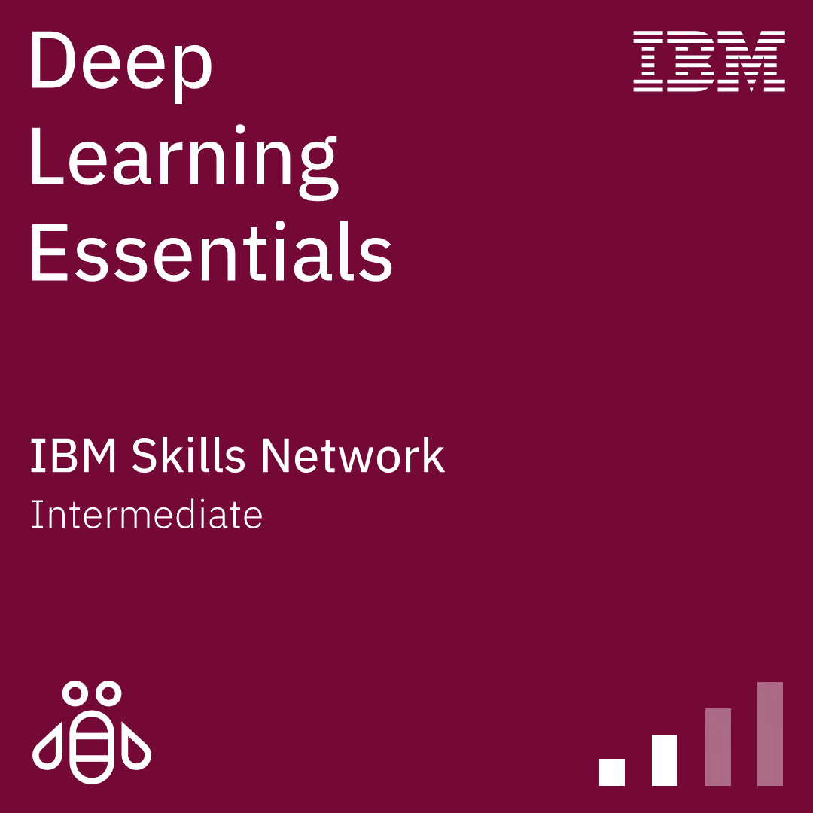

<h2>Hi 👋! My name is Aditya S 
I'm a Year 4 CS Student with a passion in the fields of AI and ML</h2>

###

<!-- 

        
<h3>Github Stats ⚡</h3>

        

                
                
        

 -->

###

<h1>What I know</h1>
<h3>Frontend</h3>

    

<h3>Backend</h3>

    

<h3>Databases</h3>

    

<h3>Deployments</h3>

    

<h3>Version Control</h3>

    

<h3>Tech Stacks</h3>

        <h5><b>MERN (MongoDB, ExpressJS, ReactJS, NodeJS)</b></h5>
    

###

<h1>Certifications Completed</h1>

    
    

###

<h1>How to reach out to me</h1>

  
  
  

 
 

